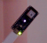

# Arduino Gesture Recognition
Gesture recognition on Arduino Nano 33 BLE Sense. Goal: Train and deploy initial PyTorch model, then implement model from scratch on Arduino.

## Current State
- Arduino accelerometer and gyroscope data collected for 2 gestures and background.
    - Tilt down
    - Tilt left
- Simple dense model trained and tested on PyTorch.

## To Do
- [ ] Deploy model to Arduino (from PyTorch)
- [ ] Write model from scratch for Arduino (Move weights from PyTorch model)
- [ ] Make gestures trigger events
- [ ] Add more gestures

## My Takeaways/Practice Areas
- Working with Arduino
- Edge deployment
- C++ and writing ML in C++